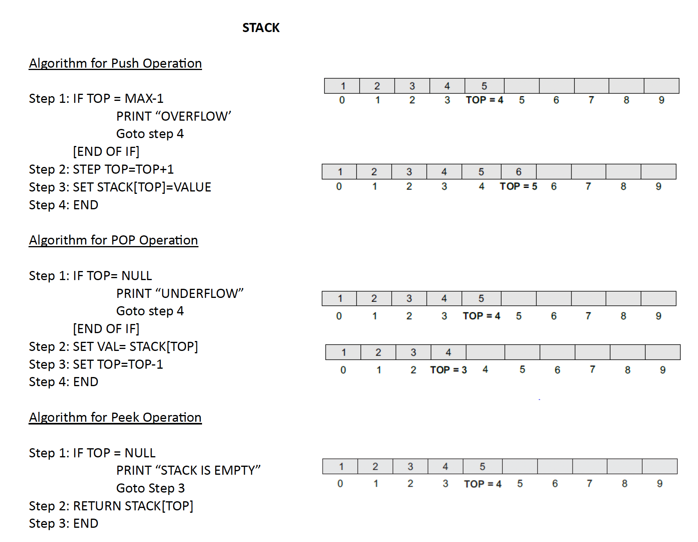

# Stack Implementation in Python and C++

The repository contains a simple implementation of the stack data structure in both Python and C++. A **stack** follows the **Last In, First Out (LIFO)** principle.

## Stack Algorithm

The following image provides an overview of how the stack operations work:



---

## Operations in Stack

- **Push**: Adds an element to the top of the stack.
- **Pop**: Removes the top element from the stack.
- **Peek**: Returns the top element without removing it.

---

## Folder Structure

- **Python Implementation**: [`stackcode.py`](stackcode.py)
- **C++ Implementation**: [`Stack.cpp`](Stack.cpp)

---

## How to Run

### Python
To run the Python implementation:
```bash
python3 stackcode.py
```

### C++
To compile and run the C++ implementation:
```bash
g++ -o stack Stack.cpp
./stack
```

---

Feel free to explore and contribute!
